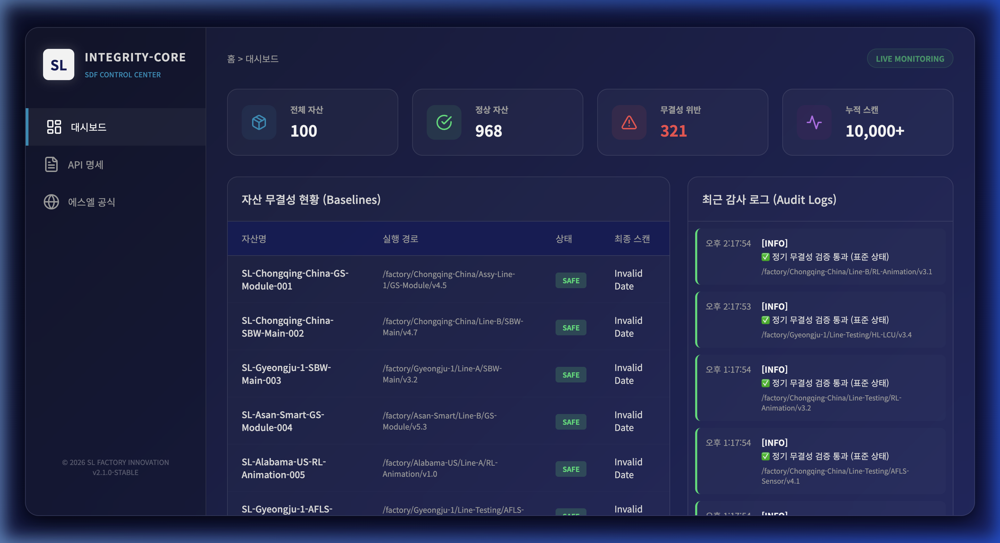

# sl-integrity-core (에스엘 무결성 핵심 관제 시스템)

## 🏢 개요
본 플랫폼은 **에스엘(SL) 공장혁신팀**의 **SDF(Software Defined Factory)** 구현을 위해 설계된 **엔터프라이즈급 자산 무결성 관제 솔루션**입니다. 
분산된 공장 노드의 모든 소프트웨어, 설정 파일, 그리고 물류 데이터 패키지가 인가되지 않은 수단으로 변조되지 않았음을 수학적으로 증명하고 실시간으로 감시합니다.

## 🖥️ 통합 관제 센터 (Monitoring Dashboard)

> **SDF Control Center**: Glassmorphism 디자인이 적용된 현대적인 UI를 통해 10,000건 이상의 전사 무결성 상태를 한눈에 파악할 수 있습니다.

---

## 🛡️ 무결성 관제 3단계 프로세스 (Operation Guide)

1.  **[Step 1] 기준점 등록 (Baseline Registration)**
    - 신뢰할 수 있는 소프트웨어/설정 폴더를 시스템에 등록합니다.
    - `dirhash` 엔진이 폴더 전체의 '디지털 지문(SHA-256)'을 생성하여 Oracle DB에 영구 기록합니다.
2.  **[Step 2] 비동기 자동 스캔 (Automated Auditing)**
    - FastAPI의 **Background Tasks**가 공장 노드를 주기적으로 순회하며 현재 상태의 해시를 재계산합니다.
    - 대규모 데이터(10,000건+) 처리 시에도 생산 라인 시스템에 부하를 주지 않도록 병렬 처리됩니다.
3.  **[Step 3] 실시간 탐지 및 관여 (Detection & Alerting)**
    - 기준점과 현재 상태가 단 1바이트라도 다를 경우 `UNSAFE` 경고를 발생시킵니다.
    - 변조 발생 시각, 경로, 사유를 대시보드에 즉시 보고하여 관리자의 신속한 의사결정을 지원합니다.

---

## 📂 기술적 가치 및 JD 부합성 (Tech Stack Alignment)
본 프로젝트는 **에스엘 플랫폼 개발(경력 5년 이상)** 포지션의 핵심 요구사항을 완벽히 충족하도록 설계되었습니다.

-   **Modern Oracle Integration**: Legacy 쿼리 방식이 아닌 **SQLAlchemy 2.0 (Mapped Syntax)**를 적용하여 Oracle DB와의 높은 데이터 정합성과 유지보수성을 확보했습니다.
    -   *JD 연관성*: 기업용 Oracle DB 환경에서의 대규모 트랜잭션 처리 능력 증명.
-   **High-Performance Backend**: **FastAPI**와 **Async Tasks**를 결합하여 실시간성에 가까운 관제 성능을 구현했습니다.
-   **Enterprise Design**: 최신 UI/UX 기술(Glassmorphism, CSS Variables)을 적용하여 '공장혁신'이라는 부서 정체성에 맞는 프리미엄 인터페이스를 제공합니다.

---

## 🚨 보안 인사이트 (Security Scraps)
본 시스템은 다음과 같은 실제 보안 위협에 대응하기 위해 기획되었습니다.

-   **공급망 공격(Supply Chain Attack) 대응**: 2024년 국내 자동차 부품 K사 랜섬웨어 사고와 같이, 협력사 소프트웨어 변조를 통한 대규모 리콜 사태를 미연에 방지합니다.
-   **ISMS-P 인증 대응**: "주요 시스템 파일 및 설정에 대한 무결성 검증"이라는 필수 통제 항목을 자동화하여 인증 유지 비용을 획기적으로 절감합니다.
-   **SDF 신뢰성 보장**: 스마트 팩토리의 모든 제어 로직이 'Golden Image(원본)' 상태임을 수학적으로 보장합니다.

---

## 🏗️ 빠른 시작 (Quick Start)
모든 환경은 자동화되어 있습니다. 단 하나의 명령어로 전체 시스템을 실행할 수 있습니다.

```bash
# 1. 저장소 이동
cd SL-Integrity-Core

# 2. 통합 러너 실행 (Venv 생성, DB 초기화, 1만건 시뮬레이션, 서버 실행 통합)
python3 run_platform.py
```

-   **대시보드 접속**: `http://localhost:8000/`
-   **API 문서**: `http://localhost:8000/docs`

---

## 📜 라이브러리 출처 및 감사
본 플랫폼의 핵심 해싱 엔진은 [@andhus](https://github.com/andhus)님의 [dirhash-python](https://github.com/andhus/dirhash-python) 기술을 기반으로, 에스엘의 엔터프라이즈 환경에 맞게 커스터마이징 및 플랫폼화되었습니다. 훌륭한 오픈소스 기술에 감사드립니다.

## 🚦 빠른 시작 (Quick Start)
**`99.Develop` 터미널 위치**에서 아래 명령어 하나면 모든 설정과 실행이 완료됩니다.

```bash
```

---

## 🛠 수동 설치 및 실행
1. 가상환경 생성 및 진입: `python3 -m venv venv && source venv/bin/activate`
2. 의존성 설치: `pip install -r requirements.txt`
3. 서버 실행: `export PYTHONPATH=. && python3 -m uvicorn app.main:app --host 0.0.0.0 --port 8000`
2. 환경 변수 설정:
   - `ORACLE_USER`, `ORACLE_PASS`, `ORACLE_HOST`, `ORACLE_SERVICE`
3. 서버 실행: `uvicorn app.main:app --reload`
4. API 문서 접속: `http://localhost:8000/docs`
