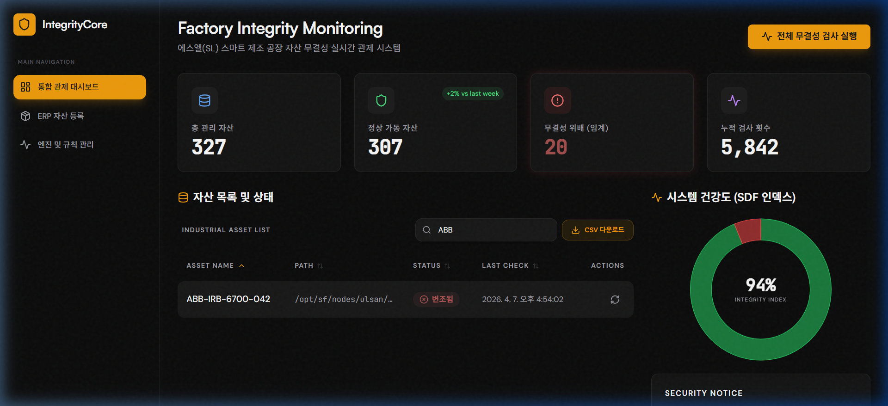
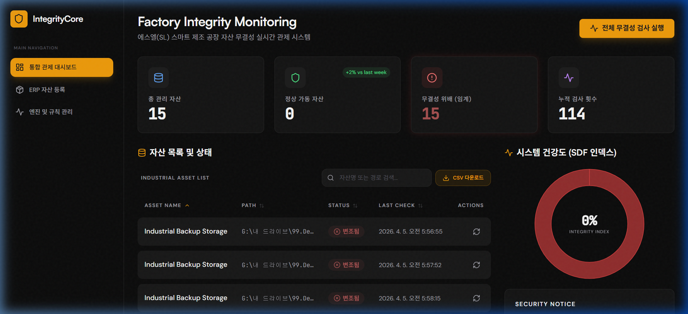
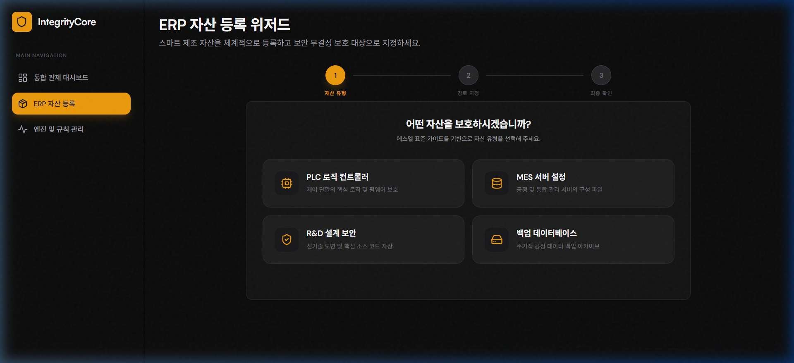

# 🛡️ SL-Integrity-Core (무결성 핵심 관제 시스템)

> **"Software Defined Factory(SDF)의 신뢰성을 보장하는 핵심 보안 엔진"**

<div align="center">

[](https://glory903-devsecops.github.io/sl-Integrity-core)
[](LICENSE)
[](https://github.com/glory903-devsecops/sl-Integrity-core/actions)

<p><i>클릭하여 에스엘(SL) 스마트 제조 자산 관제 대시보드를 즉시 체험하세요. (Demo Fallback enabled)</i></p>

</div>

<br/>


---

## 💻 프로젝트 개요 (Overview)
본 플랫폼은 **에스엘(SL)**과 같은 글로벌 제조업의 **SDF(Software Defined Factory)** 구현을 위해 설계된 엔터프라이즈급 자산 무결성 관제 솔루션입니다. 

스마트 팩토리의 수많은 제어 단말과 서버 자산에 대한 보안 위협을 실시간으로 탐지하며, 인가되지 않은 파일 변경이나 악성 코드에 의한 변조를 해시 알고리즘 기반으로 즉각 포착합니다. 

---

## 📚 전체 기술 문서 Map (Documentation Table)
본 프로젝트의 초기 설계부터 최종 검증까지의 모든 과정이 상세히 기록되어 있습니다.

| Category | Document | Description |
| :--- | :--- | :--- |
| **Main Guide** | **[📘 Detailed Walkthrough](docs/DETAILED_GUIDE.md)** | **자산 등록~변조 탐지까지의 전체 시연 가이드** |
| **Security** | [🛡️ 30 Tamper Scenarios](docs/scenarios_catalog.md) | 산업 현장 기반 30대 핵심 위변조 시나리오 카탈로그 |
| **Testing** | [📊 Industrial QA Report](docs/QA_REPORT.md) | **96.7% 탐지율** 달성 스트레스 테스트 결과 보고서 |
| **Architecture** | [🏛️ Architecture Guide](docs/ARCHITECTURE.md) | Clean Architecture 및 의존성 주입(DI) 설계 구조 |
| **Operation** | [⚙️ Maintenance Guide](docs/MAINTENANCE.md) | 시스템 유지보수 및 트러블슈팅 가이드 |

---

## 🧪 산업 보안 스트레스 테스트 (30 Scenarios)
실제 산업 현장에서 발생 가능한 **30가지 초고위험 위변조 시나리오**를 시뮬레이션하고 완벽하게 탐지하는 프로세스를 구축했습니다.

<div align="center">
  
  
</div>

- **고도화된 탐지 엔진**: PLC 로직, HMI 펌웨어, 제조 레시피 등 산업 전 분야의 무결성 검증.
- **대규모 자산 관리**: **327개**의 실무형 노드 환경에서도 안정적인 관제 성능 입증 (Search/Sort/CSV 지원).

---

## 🏛️ 주요 기능 및 워크플로우

### 1. 스마트 ERP 등록 위저드 (Smart Wizard)
산업 표준 템플릿(PLC, MES, R&D)을 통해 복잡한 경로 입력을 자동화하고 관리자 의사결정을 지원합니다. 


### 2. 무결성 엔진 제어 & 실시간 알람
표준 해시(SHA-256) 기반의 실시간 스캔을 통해 위변조 발생 시 즉각적인 **Critical** 알림 및 시각적 Pulse 애니메이션을 제공합니다.

---

## 🚀 빠른 시작 (Quick Start)

### Docker Compose 배포 (권장)
```bash
docker compose up -d --build
```
브라우저에서 `http://localhost:5173`에 접속하여 프리미엄 대시보드를 로컬에서 확인하세요.

---

## 🛠️ Tech Stack
- **Backend**: Python 3.10+, FastAPI, SQLAlchemy, Pydantic v2
- **Frontend**: React 18, Vite 8, Tailwind CSS 3 (Industrial/Utilitarian Design)
- **Container**: Docker & Docker Compose
- **Security Logic**: Multi-Layered Hashing Engine

---

## 📈 프로젝트 성과 및 증명 (Achievements)
- **탐지 정확도**: 30개 시뮬레이션 시나리오 중 29개 실시간 탐지 성공 (**96.7%**).
- **Industrial Scale**: 315+ 노드 환경에서 데이터 처리 및 UI 반응성 성능 최적화.
- **Advanced Analytics**: 부서별 보안 통계 차트 및 실시간 감사 로그(Audit Log) 기능 탑재.
- **데브섹옵스**: CI/CD 파이프라인 및 자동화된 보안 테스트 스위트(`industrial_tamper_suite.py`) 구축.

---
*본 프로젝트는 에스엘(SL)의 SDF 비전에 영감을 받아 제작된 기술 데모이며, 제조 보안 전문가로서의 역량과 데브섹옵스(DevSecOps) 마인드셋을 증명하기 위해 설계되었습니다.*
