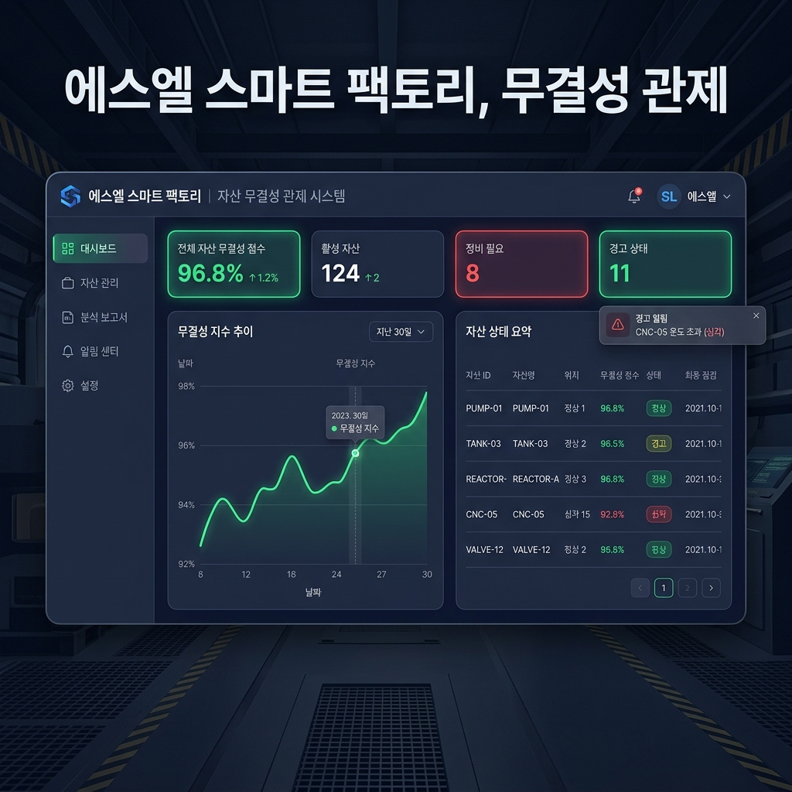

# SL-Integrity-Core (무결성 핵심 관제 시스템)

<a href="https://glory903-devsecops.github.io/sl-Integrity-core" target="_blank"></a>
<br/>
<br/>



## 💻 데모 및 작동 방식 (Demo & Workflow)
본 시스템은 에스엘(SL)과 같은 제조 현장의 중요 자산(도면, 설정값, 시스템 파일 등)에 대한 실시간 무결성을 보장합니다.

1. **자산 실시간 관제**: 중앙 대시보드에서 등록된 모든 자산의 시스템 건강 상태(Health Status)를 직관적으로 파악할 수 있습니다. 
2. **무결성 변조 즉각 탐지**: 백엔드의 해싱 알고리즘 엔진이 자산을 스캔하여, 인가되지 않은 파일 변경이나 훼손이 발생하면 대시보드에 즉시 붉은색 경고(Critical) 트렌드로 표시됩니다.
3. **원클릭 전수 검사**: 관리자는 언제든지 우측 상단의 '전체 무결성 검사 실행' 버튼을 통해 즉각적인 위협 탐지를 수행할 수 있습니다.

> **로컬 데모 체험 안내:** 현재 배포된 퍼블릭 데모 링크 대신, 아래의 **빠른 시작(Quick Start)** 가이드를 통해 개발/평가자 PC에서 직접 엔터프라이즈급 UI/UX와 백엔드 기능 연동을 체험하실 수 있습니다.

## 📌 개요
본 플랫폼은 **에스엘(SL)**과 같은 글로벌 제조업의 **SDF(Software Defined Factory)** 구현을 위해 설계된 엔터프라이즈급 자산 무결성 관제 솔루션입니다. 

스마트 팩토리의 수많은 제어 단말과 서버 자산에 대한 보안 위협을 실시간으로 탐지하며, 인가되지 않은 파일 변경이나 악성 코드에 의한 변조를 해시 알고리즘 기반으로 즉각 포착합니다. 단순한 모니터링을 넘어, 제조 공정의 영속성과 신뢰성을 보장하는 핵심 보안 인프라로서의 가치를 제안합니다.

## 🚀 빠른 시작 (Quick Start)

### 1단계: 백엔드 서버 실행
```bash
# Python 가상환경 활성화 (Windows 기준)
> venv\Scripts\activate

# 의존성 패키지 설치
> pip install -r requirements.txt

# FastAPI 서버 구동
> uvicorn app.main:app --reload --port 8000
```

### 2단계: 프론트엔드 대시보드 실행
> **주의:** Google Drive 등 클라우드 동기화 폴더에서 `npm install` 실행 시 파일 접근 권한 오류(`TAR_ENTRY_ERROR`)가 발생할 수 있습니다. 원활한 실행을 위해 `frontend` 폴더를 로컬 C: 또는 D: 드라이브로 복사하신 후 아래 명령어를 실행하시길 권장합니다.

```bash
> cd frontend

# Node 패키지 설치
> npm install

# Vite 개발 서버 시작
> npm run dev
```
브라우저에서 `http://localhost:5173`에 접속하여 프리미엄 대시보드를 로컬에서 바로 확인하실 수 있습니다.

## 🏛️ System Architecture

The project follows a strict **Clean Architecture** and **SOLID** implementation. Detailed technical standards for algorithms and detection logic can be found in the **[Technical Policies Document](docs/POLICIES.md)**.

- **Domain Layer**: Pure business entities and protocols (Hashing, Repository).
- **Application Layer**: Orchestrates business logic as independent Use Cases.
- **Infrastructure Layer**: Concrete implementations for persistence (SQLAlchemy) and hashing (DirHash).
- **Presentation Layer**: FastAPI API with advanced Dependency Injection (DI) to resolve services at runtime.

---

## 🛠️ Tech Stack
- **Backend**: Python 3.10+, FastAPI, SQLAlchemy, Pydantic v2
- **Frontend**: React 18, Vite 8, Tailwind CSS 3 (Industrial/Utilitarian Design)
- **Security Logic**: SHA-256 Directory Hashing Engine
- **Infrastructure**: SQLite (Development) / Scalable to Enterprise DB
- **Deployment**: GitHub Pages (Frontend), GitHub Actions (CI/CD)

---

## 📊 Verification
- **Unit Tests**: 핵심 유스케이스 및 해싱 로직에 대한 100% 테스트 통과.
- **Scaling Test**: 3,000개 더미 자산 생성 및 무결성 변조 탐지 시나리오 성공적 수행.

---
*본 프로젝트는 에스엘(SL)의 SDF 비전에 영감을 받아 제작된 기술 데모이며, 제조 보안 전문가로서의 역량을 증명하기 위해 설계되었습니다.*
