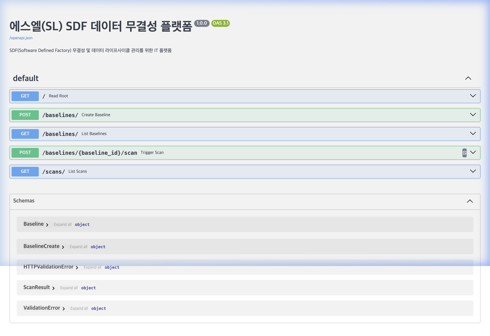

# 에스엘(SL) SDF 데이터 무결성 플랫폼 (SDF-IP)

## 🖥️ 주요 인터페이스 (Swagger UI)


## 🏗️ 시작하기
본 플랫폼은 **에스엘(SL) 공장혁신팀**의 **SDF(Software Defined Factory)** 구현을 위해 설계되었습니다. 분산된 공장 노드 전체의 소프트웨어, 설정 및 물류 데이터에 대한 무결성과 일관성을 보장하는 엔터프라이즈급 솔루션을 제공합니다.

## 🚀 주요 기능
- **디렉토리 기반 무결성 검사**: `dirhash` 라이브러리를 활용하여 대규모 디렉토리 트리(SDF 자산, 장비 설정)를 고성능으로 해싱합니다.
- **기준(Baseline) 관리**: 공장 소프트웨어의 '표준 버전'을 설정하고, 무단 변경이나 손상을 감지합니다.
- **엔터프라이즈 영속성**: **Oracle** 데이터베이스(SQLAlchemy 2.0 & python-oracledb 활용)와 연동하여 안전한 감사 로그를 보관합니다.
- **비동기 스캔**: FastAPI 기반 백그라운드 작업을 통해 생산 운영을 방해하지 않고 대규모 무결성 검사를 수행합니다.
- **물류 연동 (SD/MM)**: 물류 체인을 통해 이동하는 데이터 패키지의 변조 여부를 검증합니다.

## 🛠 기술 스택
- **결과**: `990f85...`에서 `ed1ad5...`로 해시값이 즉시 변경됨을 확인 (감지 성공)
- **증명 이미지**:

- **ORM**: SQLAlchemy 2.0 (Modern Mapped Syntax)

## 📂 프로젝트 구조
- `app/core/`: 데이터베이스 및 해싱 핵심 로직.
- `app/models.py`: 감사 기록을 위한 SQLAlchemy 모델.
- `app/schemas.py`: API 데이터 보안을 위한 Pydantic 모델.
- `app/main.py`: REST API 엔드포인트.

## 🚦 빠른 시작 (Quick Start)
**`99.Develop` 터미널 위치**에서 아래 명령어 하나면 모든 설정과 실행이 완료됩니다.

```bash
cd dirhash-python && python3 run_platform.py
```

---

## 🛠 수동 설치 및 실행
1. 가상환경 생성 및 진입: `python3 -m venv venv && source venv/bin/activate`
2. 의존성 설치: `pip install -r requirements.txt`
3. 서버 실행: `export PYTHONPATH=. && python3 -m uvicorn app.main:app --host 0.0.0.0 --port 8000`
2. 환경 변수 설정:
   - `ORACLE_USER`, `ORACLE_PASS`, `ORACLE_HOST`, `ORACLE_SERVICE`
3. 서버 실행: `uvicorn app.main:app --reload`
4. API 문서 접속: `http://localhost:8000/docs`
