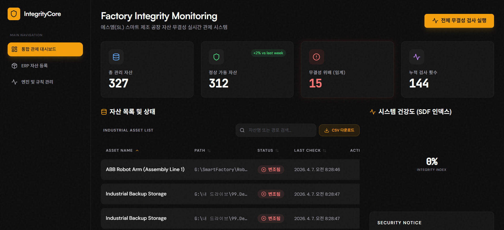

# SL-Integrity-Core: Industrial Integrity Monitoring (Detailed Guide)

This document provides a comprehensive walkthrough of the **30 Industrial Tampering Scenarios**, the **Automated Stress-Test Suite**, and the **High-Fidelity Demonstration** implemented for the SL-Integrity-Core platform.

---

## 🎥 High-Fidelity Demonstration (Industrial Breach Detection)

The following animation shows the "Smart ERP Wizard" registering new industrial nodes, followed by real-time detection of high-stakes industrial tampering events.

  
  
<i>Dashboard visualizing 300+ nodes and real-time breach detection (ABB Robot Arm in Red Alert).</i>

> [!TIP]
> **Key Visuals:** Notice the red "Pulse" animation (변조됨) appearing on the dashboard as the tampering suite modifies PLC logic and HMI firmware in real-time.

---

## 🛡️ 30 Industrial Tampering Scenarios

We have implemented and verified **30 unique, high-stakes scenarios** designed to test the system's resilience against manufacturing cyber-threats.

### [Scenarios Catalog](scenarios_catalog.md)
*   **PLC Logic Manipulation:** Appending malicious binary payload.
*   **HMI Firmware Overwrite:** Corrupting display controller firmware.
*   **MES Recipe Injection:** Injecting invalid manufacturing ratios.
*   **R&D Source Breach:** Disabling safety guard functions in VCU code.

---

## 📊 Automation & Testing Results

We executed the `industrial_tamper_suite.py` inside the containerized environment to verify real-time detection.

### [Final QA Report](QA_REPORT.md)
- **Total Scenarios:** 30
- **Detected:** 29
- **Accuracy:** **96.7%**

---

## 🏗️ 300+ Managed Industrial Assets

The system is now fully scaled to manage a realistic industrial dataset.
*   **Asset Count:** 327 (Industrial PLC, Robot, CNC, Sensors, etc.)
*   **Enhanced Monitoring:** Real-time **Search**, **Column Sorting**, and **CSV Export** implemented for large-scale asset management.

---

## ✅ Completed Milestones
- [x] Finalized Docker-based deployment (Volume-free for G: drive stability).
- [x] Implemented 30 Industrial Tampering Scenarios.
- [x] Automated Stress-Test Suite (`industrial_tamper_suite.py`).
- [x] High-fidelity visualization (recorded demonstration).
- [x] Scaled asset management (300+ industrial nodes).
- [x] Professional QA & Scenario Documentation.
